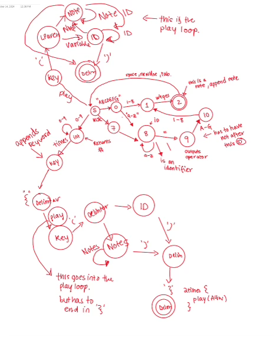

# PLT-Music-Compiler
Music Compiler

## Lexical Grammar
Our program ignores whitespace. 

KEYWORD= ["times", "play"] <br>

Rules: <br>
"times" has to follow an integer. <br> 
"times" has to be followed by an open bracket "{" <br> 
"play" has to be followed by an open parenthesis "(" <br>


<br>
NUMBERS = [0-9] <br>
Rules: <br>
A number can appear before times as first token. <br>
A number can be part of a note. It must follow a letter (note key) [A-G] and precede a length key (w|h|q|e|s) <br>

<br>
IDENTIFIER = ['A-Z']['a-z']* <br>
    Examples: Happy, Birthday, Variable <br>
Rules: <br>
A variable can be defined as a single captial letter [A-Z] followed by any length string of [a-z] chars. <br>
An identifier must precede an '=' sign <br>


<br>
OPERATORS = ["="] <br>
Rules: <br>
An equals sign must follow an identifier and be followed by a NOTE token. 
<br>
<br>

NOTE = [("A-G")(1-8)("w|h|q|e|s")] <br>
Examples: A4w, B3h, G4w, C4w, D4w. <br>
Rules:
A note can be defined after an '=' char <br>
A note can be defined after an open parenthesis '(' <br>
<br>


DELIMITER = ["(", ")", '{', '}'] <br>
Rules: <br>
'(' follows "play" keyword and must have a enclosing '). <br>
'{' follows "times" keyword and must have enclosing '}' <br>


Example Program: <br>
    Variable_name= A4w C2h B43  <br>
    2times {play ( variable_name )}  <br>

<br>

## Usage  
Make sure you have python3 installed. You can install it from here https://www.python.org/downloads/
### Option 1, Our own test cases
Now make sure to set the permission for the .sh files. You use these two commands. Run them one after 
the other <br>
``` chmod +x run_scanner.sh ```
<br> 

``` chmod +x run_tests.sh ```
<br>
The provided test cases (see below) are also built into our code. You can run these test cases using the following command. <br> 

``` ./run_tests.sh ``` 

### Option 2, Scan input from the command line
You can enter your own input into the system using the command<br>
``` ./run_scanner.sh ``` 
When you are done entering your own input, to send the EOF, press control + d on mac or ctrl + z on windows. 


## Tests
### Test 1
Input: <br>

Thats= G4w That= G4h Me= B4h Espresso= C4q B4q B4 A4q 5times{play(Thats That Me Espresso A4w B3h G4w)}
<br>
Expected output:

```
 ('IDENTIFIER', 'Thats')
    ('OPERATOR', '=')
    ('NOTE', 'G4w')
    ('IDENTIFIER', 'That')
    ('OPERATOR', '=')
    ('NOTE', 'G4h')
    ('IDENTIFIER', 'Me')
    ('OPERATOR', '=')
    ('NOTE', 'B4h')
    ('IDENTIFIER', 'Espresso')
    ('OPERATOR', '=')
    ('NOTE', 'C4q')
    ('NOTE', 'B4q')
    ('NOTE', 'B4w')
    ('NOTE', 'A4q')
    ('INTEGER', '5')
    ('Keyword', 'times')
    ('Keyword', '{')
    ('Keyword', 'play')
    ('Delimiter', '(')
    ('IDENTIFIER', 'Thats')
    ('IDENTIFIER', 'That')
    ('IDENTIFIER', 'Me')
    ('IDENTIFIER', 'Espresso')
    ('NOTE', 'A4w')
    ('NOTE', 'B3h')
    ('NOTE', 'G4w')
    ('Delimiter', ')')
    ('Keyword', '}')
    Errors encountered:
    Error: Invalid note token, missing duration w, h, q, e, s, default as w.

```

### Test 2
Input: <br>
Is = A4w B3h It = B3h That= B3h G7h G4w Sweet= A4w B3h C4w 5times{pla(Is It That Sweet)} 

<br> Expected Output: 
```
    ('IDENTIFIER', 'Is')
    ('OPERATOR', '=')
    ('NOTE', 'A4w')
    ('NOTE', 'B3h')
    ('IDENTIFIER', 'It')
    ('OPERATOR', '=')
    ('NOTE', 'B3h')
    ('IDENTIFIER', 'That')
    ('OPERATOR', '=')
    ('NOTE', 'B3h')
    ('NOTE', 'G7h')
    ('NOTE', 'G4w')
    ('IDENTIFIER', 'Sweet')
    ('OPERATOR', '=')
    ('NOTE', 'A4w')
    ('NOTE', 'B3h')
    ('NOTE', 'C4w')
    ('INTEGER', '5')
    ('Keyword', 'times')
    ('Keyword', '{')
    ('Keyword', 'play')
    ('Delimiter', '(')
    ('IDENTIFIER', 'Is')
    ('IDENTIFIER', 'It')
    ('IDENTIFIER', 'That')
    ('IDENTIFIER', 'Sweet')
    ('Delimiter', ')')
    ('Keyword', '}')
    Errors encountered:
    Error: Missing ( in play token.
```

### Test 3
Input: <br>
Happy= A4w Birthday= A4w A9h B4w A4w D4h To = A4w A4h B4w A4w You = D4w 5times{play(Birthday To You) }

<br> Expected Output: 
```
     ('IDENTIFIER', 'Happy')
    ('OPERATOR', '=')
    ('NOTE', 'A4w')
    ('IDENTIFIER', 'Birthday')
    ('OPERATOR', '=')
    ('NOTE', 'A4w')
    ('NOTE', 'A4h')
    ('NOTE', 'B4w')
    ('NOTE', 'A4w')
    ('NOTE', 'D4h')
    ('IDENTIFIER', 'To')
    ('OPERATOR', '=')
    ('NOTE', 'A4w')
    ('NOTE', 'A4h')
    ('NOTE', 'B4w')
    ('NOTE', 'A4w')
    ('IDENTIFIER', 'You')
    ('OPERATOR', '=')
    ('NOTE', 'D4w')
    ('INTEGER', '5')
    ('Keyword', 'times')
    ('Keyword', '{')
    ('Keyword', 'play')
    ('Delimiter', '(')
    ('IDENTIFIER', 'Birthday')
    ('IDENTIFIER', 'To')
    ('IDENTIFIER', 'You')
    ('Delimiter', ')')
    Errors encountered:
    Error: Invalid octave number 9, default as octave 4.
```

### Test 4
Input: <br>
play(A4w B3h G4w C4w D4w) Someone= D3h To= A4w B3h G4w C4w D4w Love= F3q playSomeone To Love) 

<br> Expected Output: 
```
    ('Keyword', 'play')
    ('Delimiter', '(')
    ('NOTE', 'A4w')
    ('NOTE', 'B3h')
    ('NOTE', 'G4w')
    ('NOTE', 'C4w')
    ('NOTE', 'D4w')
    ('Delimiter', ')')
    ('IDENTIFIER', 'Someone')
    ('OPERATOR', '=')
    ('NOTE', 'D3h')
    ('IDENTIFIER', 'To')
    ('OPERATOR', '=')
    ('NOTE', 'A4w')
    ('NOTE', 'B3h')
    ('NOTE', 'G4w')
    ('NOTE', 'C4w')
    ('NOTE', 'D4w')
    ('IDENTIFIER', 'Love')
    ('OPERATOR', '=')
    ('NOTE', 'F3q')
    ('Keyword', 'play')
    ('IDENTIFIER', 'Someone')
    ('IDENTIFIER', 'To')
    ('IDENTIFIER', 'Love')
    ('Delimiter', ')')
    Errors encountered:
    Error: Missing ( in play token.
```

### Test 5
Input: <br>
White= D4h Lips=D4h Pale= A4w Face= B4s
Breathin= B4s C3q In= C3q The= D4q Snowflakes= C4q D4q
Burnt= E4s F3s Lungs= F3s Sour= G3s Taste= G3s
2time{play(White Lips Pale Face
Breathin In The Snowflakes
Burnt Lungs Sour Taste)}

<br> Expected Output: 
```
     ('IDENTIFIER', 'White')
    ('OPERATOR', '=')
    ('NOTE', 'D4h')
    ('IDENTIFIER', 'Lips')
    ('OPERATOR', '=')
    ('NOTE', 'D4h')
    ('IDENTIFIER', 'Pale')
    ('OPERATOR', '=')
    ('NOTE', 'A4w')
    ('IDENTIFIER', 'Face')
    ('OPERATOR', '=')
    ('NOTE', 'B4s')
    ('IDENTIFIER', 'Breathin')
    ('OPERATOR', '=')
    ('NOTE', 'B4s')
    ('NOTE', 'C3q')
    ('IDENTIFIER', 'In')
    ('OPERATOR', '=')
    ('NOTE', 'C3q')
    ('IDENTIFIER', 'The')
    ('OPERATOR', '=')
    ('NOTE', 'D4q')
    ('IDENTIFIER', 'Snowflakes')
    ('OPERATOR', '=')
    ('NOTE', 'C4q')
    ('NOTE', 'D4q')
    ('IDENTIFIER', 'Burnt')
    ('OPERATOR', '=')
    ('NOTE', 'E4s')
    ('NOTE', 'F3s')
    ('IDENTIFIER', 'Lungs')
    ('OPERATOR', '=')
    ('NOTE', 'F3s')
    ('IDENTIFIER', 'Sour')
    ('OPERATOR', '=')
    ('NOTE', 'G3s')
    ('IDENTIFIER', 'Taste')
    ('OPERATOR', '=')
    ('NOTE', 'G3s')
    ('INTEGER', '2')
    ('Keyword', 'times')
    ('Keyword', 'play')
    ('Delimiter', '(')
    ('IDENTIFIER', 'White')
    ('IDENTIFIER', 'Lips')
    ('IDENTIFIER', 'Pale')
    ('IDENTIFIER', 'Face')
    ('IDENTIFIER', 'Breathin')
    ('IDENTIFIER', 'In')
    ('IDENTIFIER', 'The')
    ('IDENTIFIER', 'Snowflakes')
    ('IDENTIFIER', 'Burnt')
    ('IDENTIFIER', 'Lungs')
    ('IDENTIFIER', 'Sour')
    ('IDENTIFIER', 'Taste')
    ('Delimiter', ')')
    Errors encountered:
    Error: Invalid token, missing s in times token.
    Error: Invalid token, missing { in times token.
```

## Steps
Please refer to our DFA image for steps of the Lexer. <br>


State S is our start state (in the middle). If we get A-G we can either have a variable name or note next. State 0 checks if the next number is a number, we have a note (go to state 1), if we get a-z we have a variable name (go to state 8). At state 1 (note) we need to see our length of note defined by one of whqes and this is a valid end state and we go back to the start state. From the start if we get H-Z we know we are at the start of a variable name, so we should get a-z next to be in state 8. In state 8 we stay here until we see an = sign. Then we move to assigning the variable to a note in state 9. State 10 continues to make sure it is a note and then we have described the possibilities for our captial letter start. <br> <br>
If at the start state we get a p, we know we are going to see the 'play' keyword. We then must see the '(' char followed by either a NOTE described earlier, or a variable name also described earlier. At the end, we must see the closing ')'. Not depicted is that at this state we return to the start state. <br> <br>
Finally, if at the start state we get an integer, we know we are going to have a loop. We read in the integer before moving on to the next state when we see the char t, which needs to follow into times. From there we have open brackets '{'. Here we can see the play keyword and loop described in the previous paragraph. Note that we have mechanisms in the code to ensure it ends with a "}". 


## Team
Grace Dong grd2120 <br>
Ben Cyna bc3096 <br>


